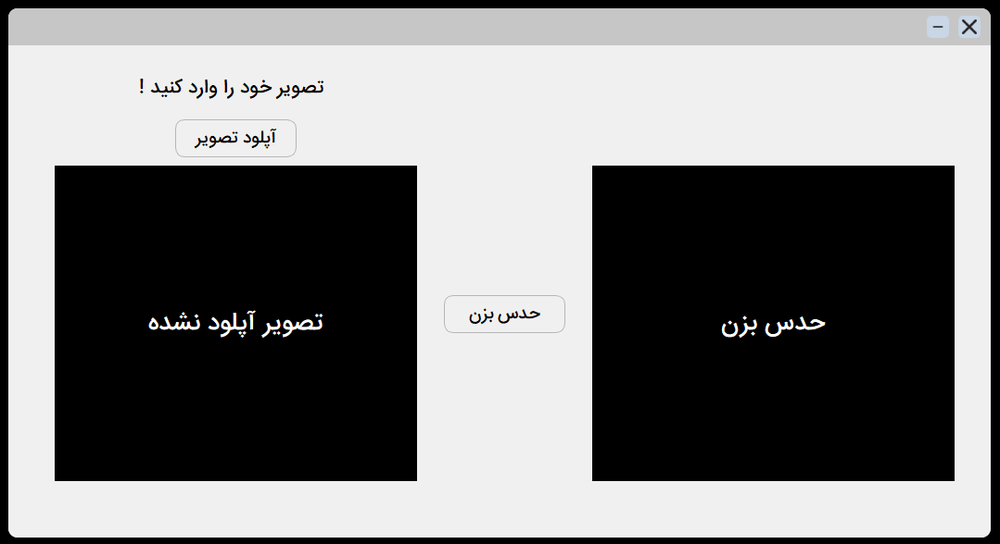
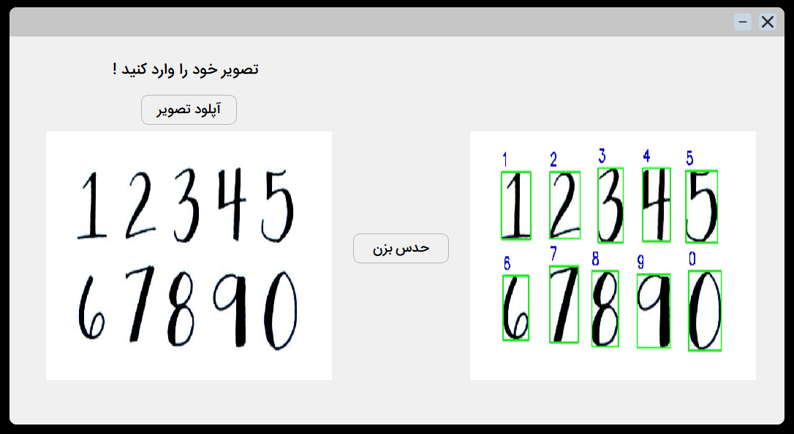

# Handwritten Number Recognition Application

This repository contains a PyQt5-based GUI application designed to recognize handwritten digits in an uploaded image using a pre-trained deep learning model.

## Features

- User-friendly GUI for digit recognition.
- Upload images (PNG, JPG, or JPEG).
- Automatic segmentation of digits from images.
- Predictions displayed directly on the image with bounding boxes and labels.
- Annotated results saved for later use.

## How It Works

1. **Upload Image**:
   - The user uploads an image containing handwritten digits through the "Upload" (آپلود تصویر) button.

2. **Digit Segmentation**:
   - The image is processed using OpenCV to detect individual digits using contours.
   - Each digit is resized to 28x28 pixels to meet the input requirements of the model.

3. **Digit Prediction**:
   - The application uses a pre-trained Keras model (`sudoscan.h5`) to predict the digits.
   - Predictions are drawn as bounding boxes and labels on the original image.

4. **Result Output**:
   - Annotated images are displayed in the application and saved in the `result` directory.

## Installation

1. Clone the repository:
   ```bash
   git clone https://github.com/AmirRghp/Number-Prediction.git
   cd Number-Prediction
2. Install the required Python packages:
   ```bash
      pip install -r requirements.txt


## Usage
1. Run the application:
   ```bash
      python main.py

2. Use the GUI:
   - Upload: Select an image file (PNG or JPG).
   - Predict: Analyze the image and display the predictions.
   - Result: View the annotated image with predictions.


## Project Structure
   - `main.py`: The main application script.
   - `predictNumUI.ui`: UI layout file designed in Qt Designer.
   - `sudoscan.h5`: Pre-trained deep learning model for digit recognition.
   - `icons/`: Folder containing icon resources.
   - `result/`: Folder to save annotated images.

## Requirements
   - `Python 3.8+`
   - `PyQt5`
   - `TensorFlow`
   - `OpenCV`
   - `NumPy`
   - `Matplotlib`

## Example Screenshots
   - Here is a screenshot of the Weather App:
   
   
   

   - Check out a video demonstration of the app:
   

## Notes
   - Make sure the pre-trained model file `sudoscan.h5` is in the same directory as `main.py`.
   - The annotated image will be saved in the `result/` folder.

## Contributing
   Contributions are welcome! Feel free to open issues or submit pull requests.
